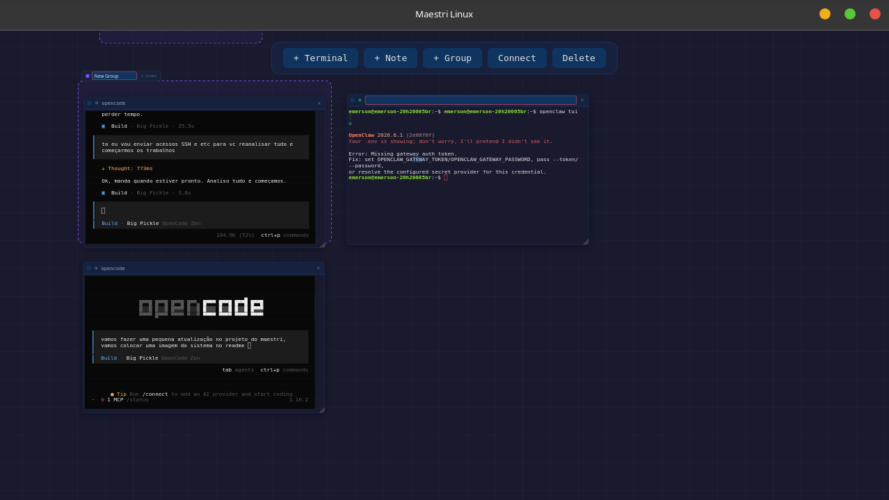

# Maestri Linux — Infinite Canvas for AI Coding Agents

<p align="center">
  <strong>BUILD. CONNECT. AUTOMATE.</strong>
</p>

<p align="center">
  <a href="#"></a>
  <a href="LICENSE"></a>
</p>

**Maestri Linux** is an _infinite canvas_ desktop app where AI coding agents run in terminal nodes connected via PTY pipes. Drop terminals, wire them together, and watch agents collaborate in real time — all locally on your Linux machine.

Inspired by [Maestri.app](https://maestri.app) for macOS. Built from scratch for Linux with **Tauri**, **Rust**, **Svelte 5**, and **xterm.js**.

[GitHub](https://github.com/eluvju/maestri-linux)

<p align="center">
  
</p>

## Install

### AppImage (recommended)

```bash
chmod +x maestri-linux-x86_64.AppImage
./maestri-linux-x86_64.AppImage
```

### From source

```bash
git clone https://github.com/eluvju/maestri-linux.git
cd maestri-linux

npm install
npm run tauri build

# Binary at src-tauri/target/release/maestri-linux
```

## Quick start

```bash
./maestri-linux
```

- **Double-click** canvas — choose a service (Shell, OpenCode, OpenClaw, Codex CLI).
- **Drag** nodes to arrange. Resize from bottom-right corner.
- **Double-click label** to rename. Click color dot to pick a color.
- **+Note** creates a sticky note (markdown, inline editor, monospace terminal look).
- **+Group** creates a container — drag its header to move all children at once.
- **Assign nodes to groups** via the `⊞` dropdown in each node's header.
- **Board auto-saves** — close and reopen, everything is where you left it.

Each terminal spawns a real PTY running your default shell. For non-shell services (opencode, openclaw, codex), the command is auto-typed after spawn.

## Features

- **Infinite canvas** — pan/zoom with DOM-based transforms, no limits.
- **Real PTY terminals** — each node runs a real shell via `portable-pty`.
- **Node renaming & colors** — double-click to edit label, 12-color palette picker.
- **Resizable nodes** — drag the bottom-right corner to resize.
- **Sticky notes** — markdown notes with inline editor, saved to `~/.local/share/maestri-linux/notes/`.
- **Groups** — group nodes together, move/rename the container, cascade delete.
- **Service selector** — pick Shell, OpenCode, OpenClaw, or Codex CLI on node creation (ASCII art modal).
- **Board persistence** — auto-saves every mutation to `~/.local/share/maestri-linux/board.json`.
- **xterm.js** — battle-tested terminal emulator (VS Code engine).
- **Local-first** — no telemetry, no accounts, fully offline.
- **Small binary** — ~13MB Rust binary, ~80MB AppImage.

## Architecture

```
Tauri v2 (Rust backend)
  state.rs    — Graph model (nodes, groups, connections) + save/load + sticky notes
  pty.rs      — PTY manager (spawn shell, reader thread, buffer, auto-type command)
  lib.rs      — Tauri commands (create/remove/move/label/color/resize nodes,
                groups CRUD, sticky notes, pty, log)

Svelte 5 (frontend)
  Canvas.svelte       — Pan/zoom infinite canvas (slot-based)
  TerminalNode        — xterm.js terminal with drag, resize, header inline editing
  StickyNoteNode      — Markdown note with monospace terminal look, inline editor
  GroupNode           — Dashed border container, move children, rename
  NodeHeader          — Color picker, inline rename, group assignment dropdown
  CreateNodeModal     — Service selector (ASCII art), passes service + command
  Toolbar             — +Terminal, +Note, +Group, Connect, Delete
  nodesStore          — Reactive stores for nodes, connections, groups
```

## Development

```bash
npm run tauri dev     # Dev mode with hot reload
npm run tauri build   # Release build
cargo test            # Run Rust unit tests (PTY, graph, groups)
```

Prerequisites: Rust, Node.js 20+, and [Tauri system deps](https://v2.tauri.app/start/prerequisites/).

## Debug

```bash
rm -f /tmp/maestri-linux.log && maestri-linux & sleep 5 && cat /tmp/maestri-linux.log
```

## License

MIT
